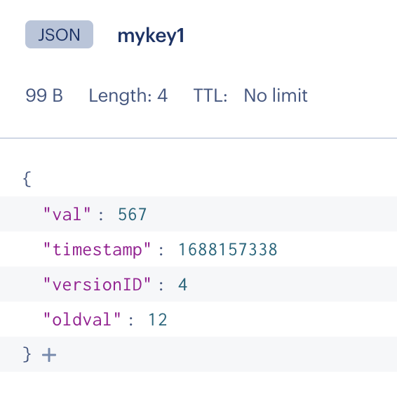

This command line program uses LUA scripting server-side to implement check and set behavior in Redis.

It also uses a very simple JSON object as the wrapper for the protected value.


It first loads (checks to see if it is already loaded) the LUA scripts that do the Check And Set for JSON objects.
It then runs several tests deleting and recreating the same JSON key with a variety of values.  (the versionID is reset to 1 each time a new Key is created)

Later, It uses the LUA script while managing the incrementing of the versionID in an atomic fashion so that if the wrong versionID is provided, no change to the key occurs.  In this second test - the key is sustained and versionID increments beyond 1.

To run: 
- make sure you have dotnet 7 installed on your system to support C# execution
- install NRedisStack 
```
dotnet add package NRedisStack
```
- modify the top of the Main method code in the Program.cs file (around line 11-15) so that the configuration details for Redis match your instance of Redis
- make sure you are running a version of Redis that has the JSON module installed
- execute 
```
dotnet run
```
and read the output to see what occurred : (note the first test fails deliberately with an empty string passed as the argument)

```
owentaylor@Owens-MacBook-Pro checkandset1 % dotnet run
New SHA value for LUA script is: e50b806f903c09f27695760368653353a2dfacc3
New SHA value for LUA script is: 7e701099df9d7b90c6cd67e414fd2f3c0fd9a816
This program will use Check and Set logic to modify a key in Redis
The key is of type JSON and requires that you have the JSON module installed
A LUA script handles updating the key with a new value  when the versionID is correct (in a simple, fixed path within the JSON object)
If the version ID is a mismatch, the program will not update the value in the key
(A future version will utilize JSON.MERGE to reduce complexity - once it is available in ACRE)


*****************   ************************    *************

testJSONEscapingWithPath called with: test.path.1 and 
ERROR returned value from LUA = ERR Error running script (call to f_7e701099df9d7b90c6cd67e414fd2f3c0fd9a816): @user_script:1: expected value at line 1 column 17


*****************   ************************    *************

testJSONEscapingWithPath called with: test.path.1 and {"tryme1": "a simple string with spaces"}

        Response from Check and Set lua call: 1

 JSON object in Redis now looks like this:

{"test.path.1":{"tryme1":"a simple string with spaces"},"versionID":1}


*****************   ************************    *************

testJSONEscapingWithPath called with: test.path.1 and {"tryme2": 1234567}

        Response from Check and Set lua call: 1

 JSON object in Redis now looks like this:

{"test.path.1":{"tryme2":1234567},"versionID":1}


*****************   ************************    *************

testJSONEscapingWithPath called with: test.path.1 and {"tryme3": {"nested1": "a nested simple string with spaces"}}

        Response from Check and Set lua call: 1

 JSON object in Redis now looks like this:

{"test.path.1":{"tryme3":{"nested1":"a nested simple string with spaces"}},"versionID":1}


*****************   ************************    *************

testJSONEscapingWithPath called with: test.path.1 and {"tryme4": {"nestedPeers1": "a nested simple string with spaces", "nestedPeers2": "a second nested simple string with spaces"}}

        Response from Check and Set lua call: 1

 JSON object in Redis now looks like this:

{"test.path.1":{"tryme4":{"nestedPeers1":"a nested simple string with spaces","nestedPeers2":"a second nested simple string with spaces"}},"versionID":1}


*****************   ************************    *************

testJSONEscapingWithPath called with: test.path.1 and {"usingArray1": [{"nested1": "a nested simple string with spaces"},{"nested2": "a second nested simple string with spaces"}]}

        Response from Check and Set lua call: 1

 JSON object in Redis now looks like this:

{"test.path.1":{"usingArray1":[{"nested1":"a nested simple string with spaces"},{"nested2":"a second nested simple string with spaces"}]},"versionID":1}


*****************   ************************    *************

testJSONEscapingWithPath called with: test.path.1 and {"nestingArrayInNestedKey1": {"vsl": [{"nested1": "a nested simple string with spaces"},{"nested2": "a second nested simple string with spaces"}]}}

        Response from Check and Set lua call: 1

 JSON object in Redis now looks like this:

{"test.path.1":{"nestingArrayInNestedKey1":{"vsl":[{"nested1":"a nested simple string with spaces"},{"nested2":"a second nested simple string with spaces"}]}},"versionID":1}


*****************   ************************    *************

testJSONEscapingWithPath called with: test.path.1 and {"nestingArrayInNestedKey2": {"multiValue": [{"nested1": "a nested simple string with spaces","phone": "712-919-8999"},{"nested2": "a second nested simple string with spaces","phone": "212-921-8239"}]}}

        Response from Check and Set lua call: 1

 JSON object in Redis now looks like this:

{"test.path.1":{"nestingArrayInNestedKey2":{"multiValue":[{"nested1":"a nested simple string with spaces","phone":"712-919-8999"},{"nested2":"a second nested simple string with spaces","phone":"212-921-8239"}]}},"versionID":1}
>> Deleting, Setting, and then Reading Check and Set Value (3 remote operations) took: 00:00:00.0059247


************************

Test of reusing RedisConnection across multiple methods ...

CheckAndSetWithLuaJSONFaster() called with args: hardCodedKeyname, 200987654, 0  ...

        Response from Check and Set lua call: 1
>> Updating Check and Set Value took: 00:00:00.0030344

GetCheckAndSetJSONValue() fetches : 200987654
>> Fetching Check and Set Value took: 00:00:00.0033838
        After update -->   value of hardCodedKeyname = 200987654

Deliberately passing the wrong versionID to the CheckAndSetWithLuaJSONFaster() method.

Trying to set the value to: 999999

CheckAndSetWithLuaJSONFaster() called with args: hardCodedKeyname, 999999, 9999  ...

        Response from Check and Set lua call: 1
>> Updating Check and Set Value took: 00:00:00.0020585

GetCheckAndSetJSONValue() fetches : 200987654
>> Fetching Check and Set Value took: 00:00:00.0046049
                After deliberately failed update -->   value of hardCodedKeyname = 200987654
        [[[[[[{ ALERT }]]]]]]
        Value not updated! You need to refresh your local copy - the expected versionID is: 1


 NOTE That to be even faster than this - wherever there are multiple Redis operations, they should be placed into a pipeline and executed in a single network call
```

 The lua logic is somewhat dense 

 Here is the LUA code that accepts the target JSON path pretty printed for humans:
```
local suppliedJSONPath = ARGV[1]
local suppliedJSONValue = ARGV[2]
local suppliedVersionID = ARGV[3]

local workingVersionID = redis.call('JSON.RESP', KEYS[1], '$.versionID')
if not workingVersionID then
    workingVersionID = 1
else
    if workingVersionID[1] .. '' == suppliedVersionID .. '' then
        workingVersionID = tonumber(suppliedVersionID) + 1
    else
        if not tonumber(workingVersionID[1]) then
            workingVersionID = tonumber(workingVersionID[1])
        end
        return workingVersionID
    end
end

if redis.call('EXISTS', KEYS[1]) == 0 then
    redis.call('JSON.SET', KEYS[1], '$', '{\"' .. suppliedJSONPath .. '\": ' .. suppliedJSONValue .. '}')
else
    local workingObject = redis.call('JSON.GET', KEYS[1])
    redis.call('JSON.SET', KEYS[1], '$', workingObject)
    local outcome = redis.call('JSON.SET', KEYS[1], '$.' .. suppliedJSONPath, suppliedJSONValue)
    if not outcome then
        return {'JSON API not HAPPY - did you try to use a new path with more than 1 level deep from $? ie: town.small'}
    end
end

redis.call('JSON.SET', KEYS[1], '$.versionID', workingVersionID)

if not tonumber(workingVersionID) then
    workingVersionID = tonumber(workingVersionID[1])
end

return workingVersionID
```

