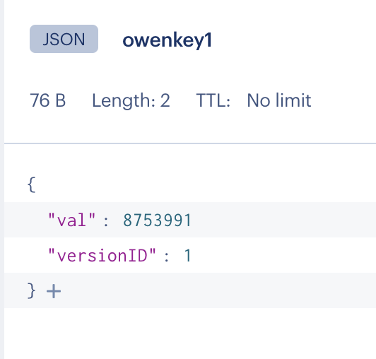

This command line program uses LUA scripting server-side to implement check and set behavior in Redis.

It also uses a very simple JSON object as the wrapper for the protected value.


It first asks the user to provide a keyname, an integer value, and a versionID of their choice and attempts to create the new key with the value provided while managing the incrementing of the versionID in an atomic fashion so that if the wrong versionID is provided, no change to the key occurs.

To run: 
- make sure you have dotnet 7 installed on your system to support C# execution
- install NRedisStack 
```
dotnet add package NRedisStack
```
- modify the top of the Main method code in the Program.cs file (around line 11-15) so that the configuration details for Redis match your instance of Redis
- make sure you are running a version of Redis that has the JSON module installed
- execute 
```
dotnet run
```
and follow the prompts as in the following example execution:

```
owentaylor@Owens-MacBook-Pro checkandset1 % dotnet run
This program will use Check and Set logic to modify a key in Redis
The key is of type JSON and requires that you have the JSON module installed
A LUA script handles updating the key with a new value  when the versionID is correct (in a simple, fixed path within the JSON object)
If the version ID is a mismatch, the program will not update the value in the key

A Gold-plated version of this program would accept a JSON path as well as the value.
(A future version will utilize JSON.MERGE to reduce complexity - once it is available in ACRE)

What keyName do you wish to use?
owenkey1
What new Value do you wish to set? [use an integer]
8753991
What versionID do you want to use? [use an integer]
The LUA script expects a 0 but accepts any integer value for new keys
(and sets the versionID to 1)
0

CheckAndSetWithLuaJSON() called with args: owenkey1, 8753991, 0  ...

        Response from Check and Set lua call: 1
>> Updating Check and Set Value took: 00:00:00.0368134

GetCheckAndSetJSONValue() fetches : 8753991
>> Fetching Check and Set Value took: 00:00:00.0314179
        After update -->   value of owenkey1 = 8753991

 This versionID will be expected for future mutations of your key: owenkey1 --> 1


************************

Test of reusing RedisConnection across multiple methods ...

CheckAndSetWithLuaJSON() called with args: hardCodedKeyname, 200987654, 0  ...

        Response from Check and Set lua call: 1
>> Updating Check and Set Value took: 00:00:00.0239791

GetCheckAndSetJSONValue() fetches : 200987654
>> Fetching Check and Set Value took: 00:00:00.0227882
        After update -->   value of hardCodedKeyname = 200987654

Deliberately passing the wrong versionID to the CheckAndSetWithLuaJSONFaster() method.

Trying to set the value to: 999999

CheckAndSetWithLuaJSON() called with args: hardCodedKeyname, 999999, 9999  ...

        Response from Check and Set lua call: 1
>> Updating Check and Set Value took: 00:00:00.0220361

GetCheckAndSetJSONValue() fetches : 200987654
>> Fetching Check and Set Value took: 00:00:00.0220558
                After deliberately failed update -->   value of hardCodedKeyname = 200987654
        [[[[[[{ ALERT }]]]]]]
        Value not updated! You need to refresh your local copy - the expected versionID is: 1


 NOTE That to be even faster than this - wherever possible, operations should be placed into a pipeline and executed in a single network call
```

 The lua logic is somewhat dense 

 Here is the LUA code pretty printed for humans:
```
local workingVersionID = redis.call('JSON.RESP', KEYS[1], '$.versionID')

if not workingVersionID then
    workingVersionID = 1
else
    if workingVersionID[1] .. '' == ARGV[2] .. '' then
        workingVersionID = ARGV[2] + 1
    else
        if not tonumber(workingVersionID) then
            workingVersionID = workingVersionID[1]
        end
        return tonumber(workingVersionID)
    end
end

if redis.call('EXISTS', KEYS[1]) == 0 then
    redis.call('JSON.SET', KEYS[1], '$', '{\"val\": ' .. ARGV[1] .. '}')
end

redis.call('JSON.SET', KEYS[1], '$.versionID', workingVersionID)
redis.call('JSON.SET', KEYS[1], '$.val', ARGV[1])

if not tonumber(workingVersionID) then
    workingVersionID = workingVersionID[1]
end

return tonumber(workingVersionID)
```

